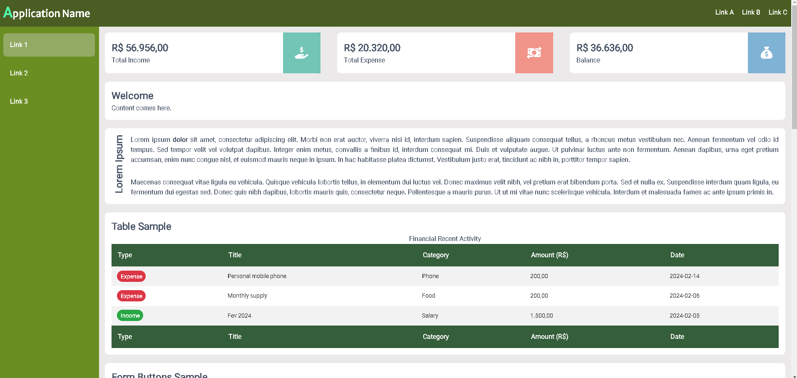
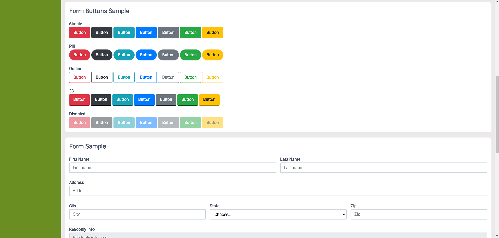
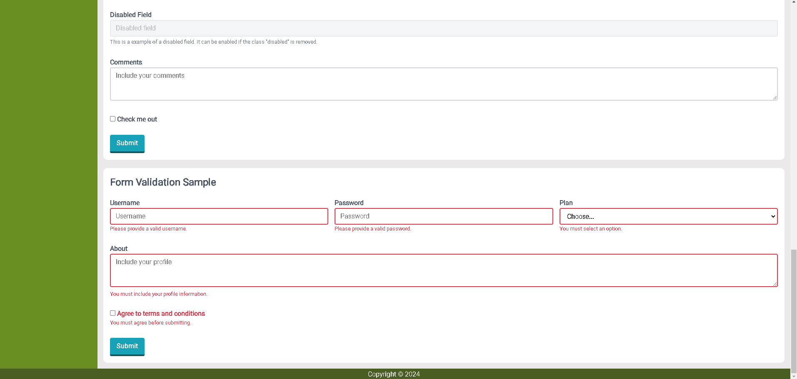
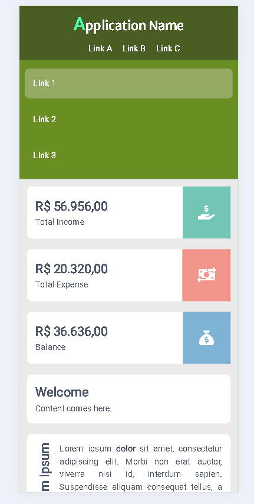
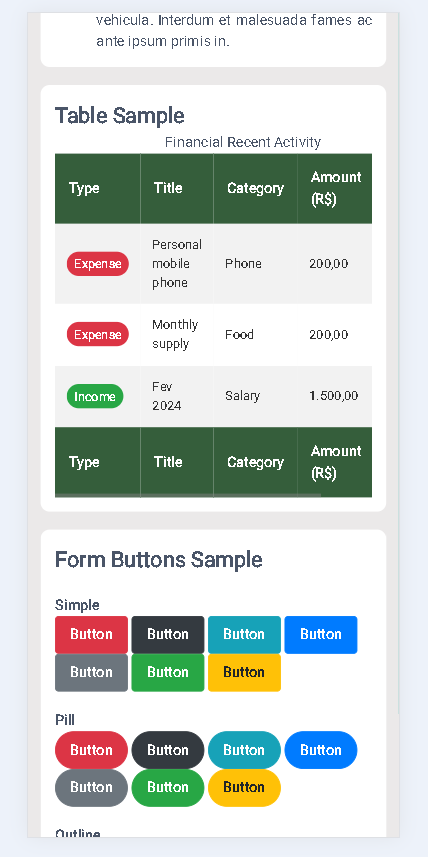

[![HTML5][html5-shield]][ref-html5]
[![CSS3][css3-shield]][ref-css3]

<h1 align="center">
  Admin Panel Layout
</h1>

# Description

This repository contains the code for a simple admin panel page using *HTML* and *CSS*. The project works as knowledge refinement and skills showcase.

# Features

- Responsive design: The page adapts to different screen sizes, ensuring a consistent user experience on desktop and mobile devices.
- Flexbox: The CSS layout model used in this project provides a flexible way to align elements and distribute space within a container element, making easier to create more complex layouts and responsive web pages.
- Mobile first approach: Meaning that the styles are projected for mobile before designing for desktop or any other devices, which can lead to a faster display of the page on smaller devices.
- Styles directory architecture: The directories of the styles are organized on a approach similar to the **7-1 pattern** used for [Sass](https://sass-guidelin.es/#the-7-1-pattern).
- Interactive components: The page includes interactive elements such as buttons and hover effects.

# Getting started

To get started with this project, follow these steps:

- Clone this repository:

```
git clone https://github.com/dehsilvadeveloper/admin-panel-layout.git
```

- Open the project folder.

- Launch the **index.html** file with your preferred web browser to view the page.

# Preview







<!-- Badge Shields -->
[html5-shield]: https://img.shields.io/badge/html5-%23E34F26.svg?style=for-the-badge&logo=html5&logoColor=white
[css3-shield]: https://img.shields.io/badge/css3-%231572B6.svg?style=for-the-badge&logo=css3&logoColor=white

<!-- References -->
[ref-html5]: https://pt.wikipedia.org/wiki/HTML5
[ref-css3]: https://pt.wikipedia.org/wiki/CSS3